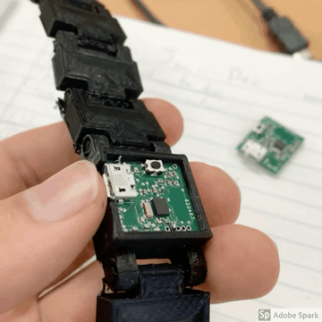
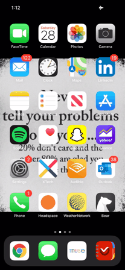

<h1>Welcome to my Smart Home Project *Not Current*</h1>
This project is a culmination of several smaller projects I was working on, once joined together created a nice ecosystem.
The code, the pcb and and all 3d mock ups visible have not been updated in a long time (between 8 months and 1.5 years depending on file).
Much of this code will not work together because of work done in this time disparity. 
The reason is because it was just after this that I pivoted to a very unique niche in the smart device market.
This is more of a proof of work rather than a source for coding inspiration.  

<h4> This is the PCB that I designed and hand built:</h4>

<h4> This is a demo of the app: <h4>

<h4> This is a version 1 of the Smart Blind: <h4>

